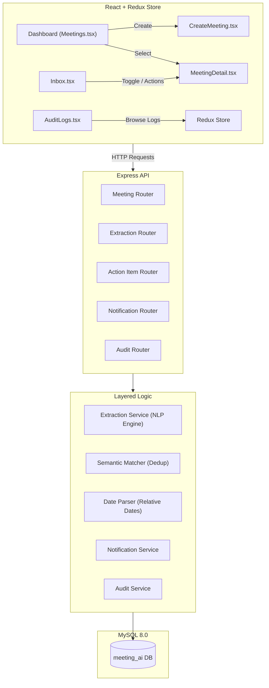
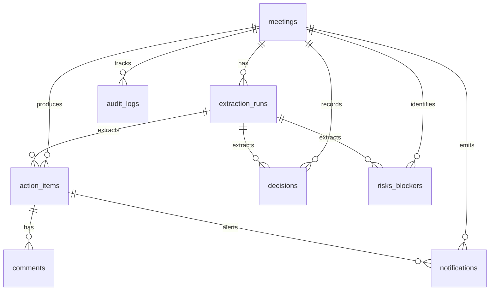

# Smart Meeting Inbox

**Smart Meeting Inbox** is an intelligent meeting management web application designed to turn messy meeting transcripts or raw pasted notes into structured, actionable intelligence—including action items, decisions, risks, and blockers.

The application features a robust NLP-based extraction engine, stable entity tracking with provenance, idempotent notifications, manual edit protection, and a complete audit trail.

---

## 🚀 Key Features

*   **Meeting Capture & Simulated Recording**: Capture meeting metadata (title, organizer, date, participants, attachment links) and paste raw transcripts. Includes a live voice simulation feature that mimics a real-time speech-to-text dialogue stream.
*   **AI Extraction Engine**: Extracts action items (tasks, owner, due date, confidence score), decisions (statement, participants involved), and risks/blockers (description, severity).
*   **Idempotency & Deduplication**: Avoids duplicate tasks upon re-processing transcripts. A content hash guard skips re-extraction if the transcript hasn't changed.
*   **Provenance Spans**: Links each extracted entity back to its exact source context in the transcript, providing full visibility and traceability.
*   **Manual Edit Protection**: Ensures user edits (renaming, reassigning, due date adjustments) are locked and never overwritten by subsequent re-extractions.
*   **Fuzzy Conflict Resolution**: Detects similar tasks (using Levenshtein distance) during re-extraction and flags them for manual merge or overwrite.
*   **Notification & Escalation System**: Generates idempotent notifications when tasks are assigned/reassigned, when due dates approach (24h/3d), or when items become overdue. Auto-escalates overdue items to the meeting organizer.
*   **Manual Merge Tool**: Combine duplicate or overlapping action items via a checkbox-selection wizard. Consolidates descriptions, reparents comment threads, logs the change, and deletes the duplicate task.
*   **Decision Follow-up Spawning**: Spawn new follow-up tasks directly from decisions on the details page. Links the spawned task back to the originating decision statement and traces it in the Inbox.
*   **Audit Logging**: Every create, update, delete, extraction, merge, or skipped override is logged in detail, complete with before/after diffs.

---

## 📐 Architecture & Data Flow



---

## 🗄️ Database Schema

The database schema utilizes MySQL relational design with indexes and cascading rules to support traceability and performance.



### Table Breakdown

1.  **`users`**: Registry of participants and task owners for notifications.
2.  **`meetings`**: Core records containing title, organizer, participants list (JSON), raw transcript text, and `content_hash`.
3.  **`extraction_runs`**: Logs each extraction execution, recording created/updated/skipped/unchanged entity counts and capturing a snapshot of the raw transcript text.
4.  **`action_items`**: Extracted tasks with `semantic_key` for deduplication, status tracking, provenance offsets, and manual edit indicators (`is_manually_edited`, `manually_edited_at`, and `version`).
5.  **`decisions`**: Agreements reached during the meeting, noting involved participants and exact source context.
6.  **`risks_blockers`**: Highlighted blockers and risks, classified by severity (low, medium, high, critical).
7.  **`comments`**: Textual comment threads attached to individual action items for collaboration.
8.  **`audit_logs`**: Comprehensive timeline capturing `old_value` and `new_value` JSON diffs for all structural modifications.
9.  **`notifications`**: User-facing notices configured with a unique `idempotency_key` to prevent duplicate alerts.

---

## 🤖 AI / Extraction Engine & Algorithms

### NLP Pattern Extraction
The application employs a **Heuristic NLP Parser** (`services/extractionService.js`) matching common patterns found in meeting scripts:
*   *Action Items*: Detects expressions like `[Name] will [verb]`, `I'll [verb]`, `[Name] should [verb]`, and `[Name] needs to [verb]`.
*   *Decisions*: Captures phrases containing `decided to`, `agreed on`, `the decision is`, or `we will go with`.
*   *Risks*: Identifies keywords such as `risk`, `concern`, `blocker`, `blocked by`, and `dependency on`.

### Stable Semantic Keys
To achieve robust deduplication, a **normalized hash algorithm** matches newly parsed tasks against existing ones regardless of minor formatting:
1.  Lowercases the text.
2.  Removes standard English punctuation and stopwords (e.g., *a, the, is, to*).
3.  Sorts the remaining words alphabetically to ensure order-independence (e.g., "Build the APIs" and "APIs build" resolve identically).
4.  Generates a SHA-256 hash stored as the stable `semantic_key`.

### Fuzzy Conflict Matching
If an extracted item is not an exact match but shares a high similarity (Levenshtein distance > 0.8), it is flagged as a conflict, allowing the user to **merge**, **keep both**, or **replace**.

### Natural Language Date Parsing
The engine's `dateParser` resolves relative temporal references (e.g., "by Friday", "tomorrow", "next Tuesday", "in 3 days", "end of month") to absolute calendar dates relative to the meeting's timestamp.

---

## 🔐 Conflict Resolution Rules

During extraction:
*   **Content Hash Check**: If a meeting transcript is re-processed without any edits, the backend instantly exits, reporting "no changes".
*   **Manual Edit Protection**: If a user manually edits a task (changes status, description, owner, or due date), `is_manually_edited` is set to `true`. Future extractions will skip overwriting this item, logging a `SKIPPED_MANUAL_EDIT` audit log to preserve user changes.
*   **Version Control**: Edits increment the item's `version` count, allowing audit trackers to trace revisions.

---

## 🛠️ Setup Instructions

### Prerequisites
*   Node.js (v18+)
*   MySQL Server (v8.0+)

### 1. Database Setup
Create your database and populate tables by running the migration script.

```bash
# In the backend directory
npm run migrate
```
Ensure you have a `.env` file in the `backend` folder configured with your credentials:
```env
PORT=5000
DB_HOST=localhost
DB_USER=root
DB_PASSWORD=your_mysql_password
DB_NAME=meeting_ai
```

### 2. Install & Start Backend
```bash
# Inside backend/
npm install
npm run dev
```
The API server will launch at `http://localhost:5000`.

### 3. Install & Start Frontend
```bash
# Inside frontend/
npm install
npm run dev
```
The React development server will start at `http://localhost:5173`.

---

## 📐 Calculation Notes (Rollover & Escalations)

*   **Due Date Reminders**: The background scheduler scans for action items where `due_date = TODAY + 1 day` (24h reminder) or `due_date = TODAY + 3 days` (3d reminder). It creates notifications idempotently to ensure only one alert is dispatched per interval.
*   **Organizer Escalation**: If an action item is still `open` or `in-progress` and the current date is strictly greater than `due_date + N days` (configurable, default is 3 days), the background job generates an escalation alert targeted at the meeting's organizer.
*   **Task Rollover & Due Date Edits**: When a task's due date is manually adjusted, a new audit entry logs the change. If an overdue task is rolled over (due date pushed forward), the `overdue` and `escalation` notification states are reset for that item, permitting future reminders.

---

## ⚖️ Tradeoffs & Design Decisions

1.  **Rule-based NLP Engine vs. LLM API**:
    *   *Tradeoff*: Used a localized heuristic regex parser rather than a live LLM API (like GPT-4).
    *   *Rationale*: Ensures sub-millisecond execution times, zero external API key billing, deterministic output mapping, and absolute user privacy (no data leaves the local server).
2.  **Human-in-the-Loop Merging vs. Automatic Overwrites**:
    *   *Tradeoff*: Required explicit user action to merge similar tasks instead of relying on the backend to automatically combine overlapping items.
    *   *Rationale*: Avoids accidental data loss or incorrect assumptions when two similar-sounding tasks exist for different owners.
3.  **Local Memory Scheduler vs. Redis/BullMQ Queue**:
    *   *Tradeoff*: Implemented notification cron jobs using an in-memory interval loop.
    *   *Rationale*: Fits the timebox requirement perfectly and doesn't introduce external service dependencies (like Redis) for the evaluator, making the local installation clean and single-command.

---

## 📝 AI Usage Disclosure

This application uses custom rule-based regular expressions and natural language tokenization algorithms (`services/extractionService.js`) to parse structural elements (Action Items, Decisions, and Risks) from transcripts. It does not send user transcript data to external third-party LLM providers.
